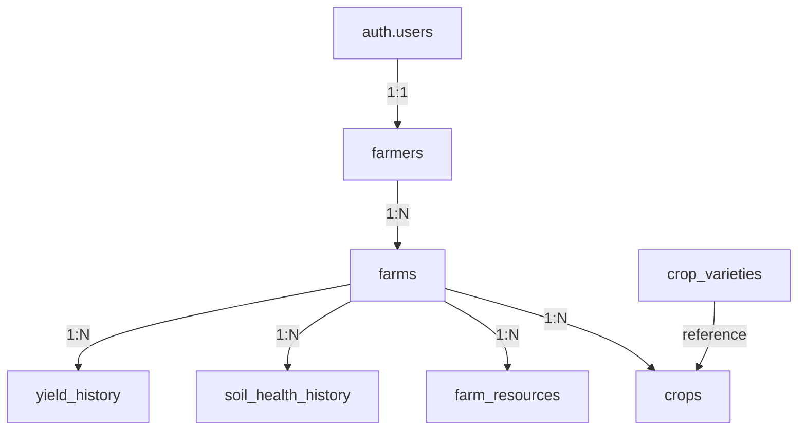

# Database Schema Reference

PostgreSQL schema managed via Supabase. All tables have Row Level Security (RLS) enabled — farmers can only access their own data.

---

## Entity Relationships



Farm deletion cascades to all child records.

---

## Tables

### `farmers`

| Column | Type | Notes |
|---|---|---|
| `id` | uuid PK | References `auth.users.id` |
| `full_name` | text | NOT NULL |
| `phone_number` | text | NOT NULL |
| `date_of_birth` | date | |
| `gender` | text | `male / female / other` |
| `education_level` | text | |
| `years_of_experience` | integer | |
| `created_at` | timestamptz | DEFAULT now() |
| `updated_at` | timestamptz | auto-updated via trigger |

RLS: users can SELECT / INSERT / UPDATE only their own row (`auth.uid() = id`).

---

### `farms`

| Column | Type | Notes |
|---|---|---|
| `id` | uuid PK | gen_random_uuid() |
| `farmer_id` | uuid FK | `farmers(id)` ON DELETE CASCADE |
| `name` | text | NOT NULL |
| `total_area` | decimal | NOT NULL |
| `address` | text | |
| `location` | jsonb | `{latitude, longitude, state, district, village}` |
| `soil_type` | text | sandy / clay / loamy / silt / peaty / chalky |
| `irrigation_type` | text | drip / sprinkler / flood / rainfed / manual |
| `ownership_type` | text | owned / leased / shared |
| `created_at` | timestamptz | |

RLS: full CRUD scoped to `auth.uid() = farmer_id`.

---

### `crops`

| Column | Type | Notes |
|---|---|---|
| `id` | uuid PK | |
| `farm_id` | uuid FK | `farms(id)` ON DELETE CASCADE |
| `crop_type` | text | NOT NULL |
| `variety` | text | |
| `sowing_date` | date | |
| `expected_harvest_date` | date | |
| `area_allocated` | decimal | NOT NULL |
| `season` | text | kharif / rabi / zaid / perennial |
| `current_growth_stage` | text | sowing / germination / vegetative / flowering / fruiting / harvesting |
| `yield_expectation` | decimal | |
| `created_at` | timestamptz | |

RLS: full CRUD where `auth.uid()` owns the parent farm.

---

### `farm_resources`

| Column | Type | Notes |
|---|---|---|
| `id` | uuid PK | |
| `farm_id` | uuid FK | |
| `resource_type` | text | tractor / harvester / plough / irrigation_pump / sprayer / storage |
| `name` | text | |
| `quantity` | integer | DEFAULT 1 |
| `condition` | text | excellent / good / average / poor |
| `purchase_date` | date | |
| `current_value` | decimal | |
| `created_at` | timestamptz | |

RLS: full CRUD scoped to owning farmer.

---

### `soil_health_history`

| Column | Type | Notes |
|---|---|---|
| `id` | uuid PK | |
| `farm_id` | uuid FK | |
| `ph_level` | decimal | |
| `nitrogen` | decimal | kg/ha or ppm |
| `phosphorus` | decimal | |
| `potassium` | decimal | |
| `organic_carbon` | decimal | % |
| `moisture_level` | decimal | % |
| `tested_date` | date | DEFAULT CURRENT_DATE |
| `created_at` | timestamptz | |

RLS: SELECT and INSERT scoped to owning farmer.

---

### `yield_history`

| Column | Type | Notes |
|---|---|---|
| `id` | uuid PK | |
| `farm_id` | uuid FK | |
| `crop_type` | text | NOT NULL |
| `variety` | text | |
| `season` | text | |
| `year` | integer | NOT NULL |
| `quantity` | decimal | NOT NULL |
| `unit` | text | DEFAULT 'kg' |
| `quality_notes` | text | |
| `created_at` | timestamptz | |

RLS: SELECT and INSERT scoped to owning farmer.

---

### `crop_varieties` (reference)

| Column | Type | Notes |
|---|---|---|
| `id` | uuid PK | |
| `crop_type` | text | NOT NULL |
| `variety` | text | NOT NULL |
| `season` | text[] | |
| `avg_yield_per_acre` | decimal | |
| `growth_duration_days` | integer | |
| `created_at` | timestamptz | |

RLS: SELECT by all authenticated users.

---

## Indexes

| Index | Table | Columns |
|---|---|---|
| `idx_farms_farmer_id` | farms | farmer_id |
| `idx_crops_farm_id` | crops | farm_id |
| `idx_farm_resources_farm_id` | farm_resources | farm_id |
| `idx_soil_health_farm_id` | soil_health_history | farm_id |
| `idx_yield_history_farm_id` | yield_history | farm_id |
| `idx_crops_type_season` | crops | crop_type, season |
| `idx_yield_history_year` | yield_history | year |

---

## Applying Migrations

```bash
cd backend
npm run db:link    # link CLI to your Supabase project
npm run db:push    # apply all migrations in supabase/migrations/
```

To reset a local Supabase instance:

```bash
npm run db:reset
```
